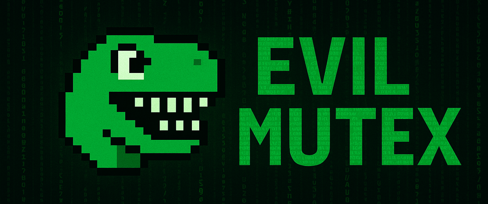

# EvilMutex

<!-- BADGES START -->
 
 
 
 

**Last Updated:** 2025-07-14 15:12:42 UTC
<!-- BADGES END -->

**Malware Mutex Intelligence Platform**

A comprehensive database of malware mutex signatures for threat intelligence, detection engineering, and cybersecurity research.

## What is EvilMutex?

Mutexes (mutual exclusion objects) are used by malware to prevent multiple instances from running simultaneously. Each malware family typically uses unique mutex names, making them excellent fingerprints for threat identification and detection.

## Quick Start

Visit the live platform: **[evilmutex.org](https://evilmutex.org)**

## License

The code for the website is licensed under the MIT License.

The signature data in the `/signatures` directory and any generated Sigma rules are licensed under the **Detection Rule License (DRL) 1.1**. See the [LICENSE](LICENSE) file for more details.

## Contributing

We welcome contributions to the EvilMutex project! Please see our [Contributing Guidelines](docs/CONTRIBUTING.md) for more information on how to add new mutexes, improve existing data, or enhance the website.

## Links

- **Website:** [evilmutex.org](https://evilmutex.org)
- **GitHub:** [github.com/adhikara13/evilmutex](https://github.com/adhikara13/evilmutex)
- **Issues:** [github.com/adhikara13/evilmutex/issues](https://github.com/adhikara13/evilmutex/issues)

---

*Built with ❤️ for the cybersecurity community* 